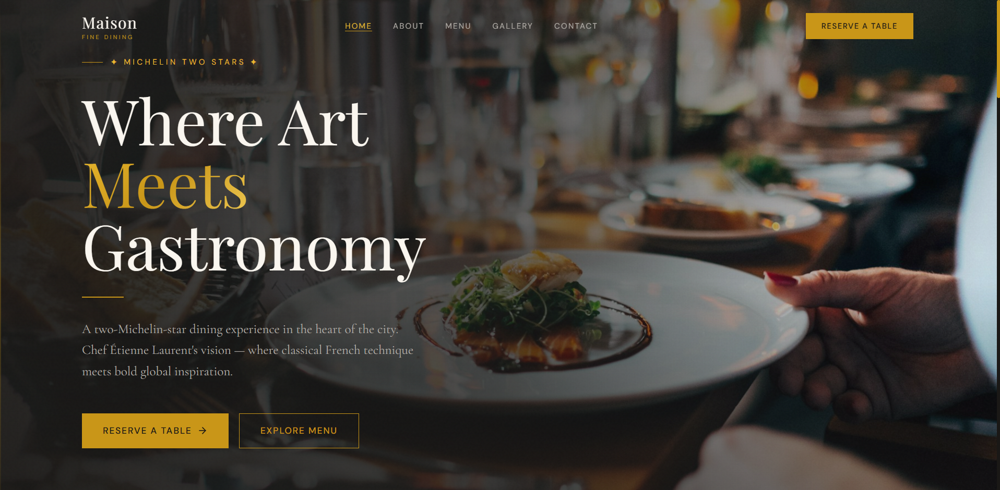

# 🍽️ Maison — Fine Dining Restaurant Website

<div align="center">


A modern, responsive restaurant website showcasing premium dining experiences with elegant design and seamless user interactions.

</div>

---

## 📸 Screenshot

<div align="center">
  
</div>

---

## ✨ Features

- 📱 **Fully Responsive** — Optimized for mobile, tablet, and desktop
- 🎨 **Premium Design** — Luxurious aesthetic with custom design tokens
- ⚡ **High Performance** — Built with Vite for lightning-fast load times
- 🔒 **Type Safe** — Full TypeScript support for robust development
- 🎭 **Smooth Animations** — CSS animations with scroll-triggered effects
- 📍 **SEO Optimized** — Meta tags and structured data ready
- 🎯 **Accessibility** — WCAG compliant components
- 📋 **Menu Management** — Dynamic menu with categories and filtering
- 📅 **Reservation System** — Multi-step booking form
- 📸 **Gallery** — Masonry layout with lightbox viewer
- 📧 **Contact Integration** — Ready for backend connection

---

## 🛠️ Tech Stack

| Technology | Purpose |
|------------|---------|
| **React 18** | UI library with hooks |
| **TypeScript** | Type-safe development |
| **Tailwind CSS** | Utility-first styling |
| **React Router v6** | Client-side routing |
| **Vite** | Lightning-fast build tool |
| **Lucide React** | Icon library |
| **Intersection Observer** | Scroll animations |

---

## 📦 Project Structure

```
src/
├── components/
│   ├── layout/              # Layout wrappers (Navbar, Footer, Layout)
│   ├── sections/            # Page sections (Hero, Featured Menu, CTA, etc.)
│   └── ui/                  # Reusable components (MenuCard, ReviewCard, etc.)
├── data/                    # Static data & constants
│   ├── menuData.ts
│   ├── navigationData.ts
│   └── restaurantData.ts
├── hooks/                   # Custom React hooks
│   ├── useScrollAnimation.ts
│   └── useScrollPosition.ts
├── pages/                   # Page components (one per route)
├── styles/                  # Global styles
├── types/                   # TypeScript interfaces
├── App.tsx                  # Router configuration
└── main.tsx                 # Application entry point
```

---

## 🗺️ Pages & Routes

| Route | Page | Description |
|-------|------|-------------|
| `/` | Home | Hero section, featured menu, story, reviews, CTA |
| `/menu` | Menu | Filterable menu with all categories |
| `/gallery` | Gallery | Masonry layout with image lightbox |
| `/about` | About | Restaurant story, values, team, awards |
| `/contact` | Contact | Contact form + location map |
| `/reservations` | Reservations | Multi-step booking form |

---

## 🚀 Getting Started

### Prerequisites

- **Node.js** ≥ 16.x
- **npm** ≥ 8.x (or yarn/pnpm)

### Installation

1. **Clone the repository**
   ```bash
   git clone https://github.com/yourusername/restaurant-website.git
   cd restaurant-website
   ```

2. **Install dependencies**
   ```bash
   npm install
   ```

3. **Start development server**
   ```bash
   npm run dev
   ```
   The app will open at `http://localhost:5173`

4. **Build for production**
   ```bash
   npm run build
   ```

5. **Preview production build**
   ```bash
   npm run preview
   ```

---

## 🎨 Design System

### Typography

| Element | Font | Usage |
|---------|------|-------|
| Headings | Playfair Display | Display headings & titles |
| Body | Cormorant Garamond | Paragraphs & italic text |
| UI | DM Sans | Labels, buttons, UI text |

### Color Palette

```
Primary Color:     #c99618 (Gold)
Background:        #1a1816 (Charcoal)
Text Primary:      #faf6ef (Cream)
Text Secondary:    #b0a89c (Warm Gray)
Accent:            #e8dcc8 (Light Beige)
```

### Spacing Scale

- **xs**: 4px | **sm**: 8px | **md**: 16px | **lg**: 24px | **xl**: 32px | **2xl**: 48px

---

## ⚙️ Configuration

### Environment Variables

Create a `.env.local` file for local development:

```env
VITE_API_URL=http://localhost:3000
VITE_MAPS_API_KEY=your_google_maps_key
```

### Customization Guide

1. **Restaurant Info** → Update `src/data/restaurantData.ts`
2. **Menu Items** → Modify `src/data/menuData.ts`
3. **Navigation & Contact** → Edit `src/data/navigationData.ts`
4. **Images** → Replace placeholder URLs with actual photos
5. **Form Submissions** → Connect to backend (Formspree, EmailJS, etc.)
6. **Maps** → Add real restaurant coordinates

---

## 📱 Browser Support

| Browser | Support |
|---------|---------|
| Chrome | ✅ Latest |
| Firefox | ✅ Latest |
| Safari | ✅ Latest |
| Edge | ✅ Latest |
| IE 11 | ❌ Not supported |

---

## 🔧 Available Scripts

```bash
npm run dev        # Start development server
npm run build      # Build for production
npm run preview    # Preview production build
npm run lint       # Run ESLint
npm run type-check # TypeScript type checking
```

---

## 📄 License

This project is licensed under the MIT License — see the [LICENSE](LICENSE) file for details.

---

## 🤝 Contributing

Contributions are welcome! Please feel free to submit a Pull Request.

1. Fork the repository
2. Create your feature branch (`git checkout -b feature/amazing-feature`)
3. Commit your changes (`git commit -m 'Add amazing feature'`)
4. Push to the branch (`git push origin feature/amazing-feature`)
5. Open a Pull Request

---

## 📞 Support

For support, email support@maison.com or open an issue on GitHub.

---

<div align="center">

Made with ❤️ by Your Team

[⬆ back to top](#-maison--fine-dining-restaurant-website)

</div>
